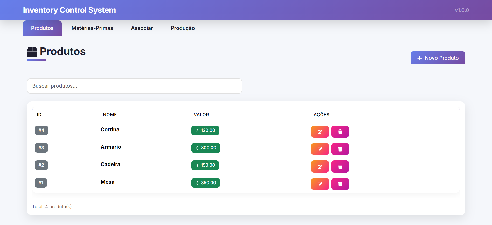
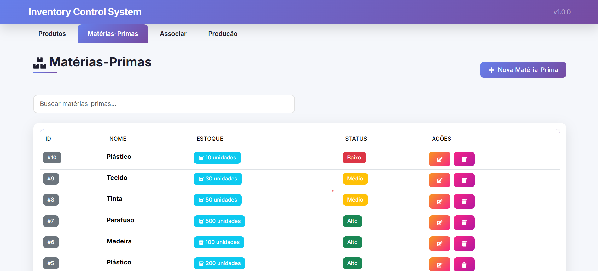
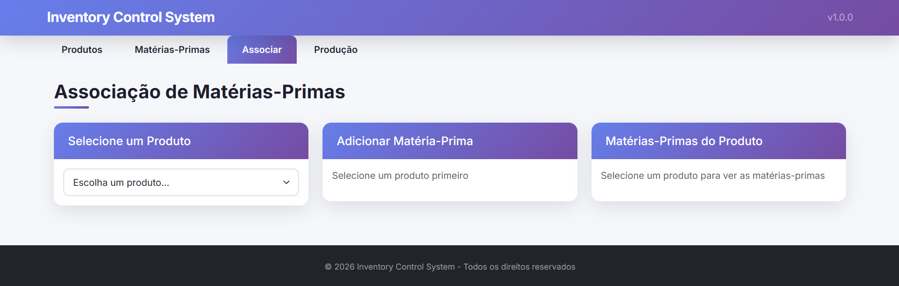
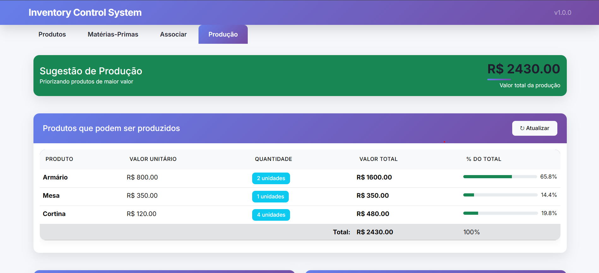

#  Inventory Control System

Sistema completo para controle de estoque de matérias-primas e produtos, com sugestão inteligente de produção priorizando itens de maior valor.

##  Funcionalidades

- ✅ **CRUD de Produtos** - Cadastro, edição, listagem e exclusão
- ✅ **CRUD de Matérias-Primas** - Controle de estoque
- ✅ **Associação** - Vincular matérias-primas aos produtos com quantidades
- ✅ **Sugestão de Produção** - Algoritmo que prioriza produtos de maior valor
- ✅ **Interface Responsiva** - Funciona em desktop, tablet e mobile
- ✅ **Design Moderno** - Gradientes, animações e ícones

##  Tecnologias Utilizadas

### Front-end
- **React** - Biblioteca para interfaces
- **Bootstrap** - Estilização responsiva
- **React Icons** - Ícones modernos
- **Axios** - Requisições HTTP

### Back-end
- **Node.js** - Ambiente de execução
- **Express** - Framework web
- **MySQL** - Banco de dados
- **CORS** - Segurança de requisições

##  Como Executar o Projeto

### Pré-requisitos
- Node.js (v14 ou superior)
- MySQL (v8 ou superior)
- Git

## PASSO A PASSO
#### 1. Clone o repositório

git clone https://github.com/SEU-USUARIO/inventory-control-system.git
cd inventory-control-system

#### 3. Configure o Back-end
cd backend

# Instale as dependências
npm install

# Configure as variáveis de ambiente
cp .env.example .env

# Edite o arquivo .env com suas configurações do MySQL
.env.example (crie este arquivo):

PORT=3000
DB_HOST=localhost
DB_USER=root
DB_PASSWORD=sua_senha
DB_NAME=inventory_control

# Inicie o servidor
npm run dev

#### 4. Configure o Front-end
Abra um novo terminal e execute:

# Volte para a raiz do projeto
cd ..

# Instale as dependências
npm install

# Inicie o React
npm start

#### 5. Acesse a aplicação
Front-end: http://localhost:3001

Back-end API: http://localhost:3000/api/health

### Screenshots

Tela de Produtos

Tela de Matérias-Primas

Tela de Associação

Tela de Sugestão de Produção

### Como o Algoritmo Funciona
O sistema usa um algoritmo de priorização que:

Lista todos os produtos com suas matérias-primas necessárias
Ordena por maior valor (do mais caro para o mais barato)
Calcula quantos de cada podem ser produzidos com o estoque atual
Consome o estoque virtualmente para os produtos mais caros primeiro
Retorna a sugestão final maximizando o valor total da produção

Exemplo Prático:
Estoque: 50 Madeiras, 100 Parafusos, 10 Tintas
Armário (R$ 800) precisa: 20 Madeiras, 30 Parafusos, 2 Tintas → 2 unidades
Mesa (R$ 350) precisa: 10 Madeiras, 20 Parafusos, 1 Tinta → 3 unidades
Total: R$ 2.650,00

